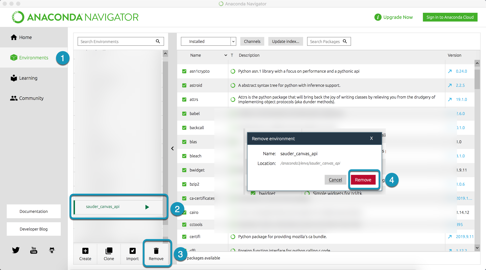

 

  

    
  

  <h3 align="center">Updating Environments</h3>

You will occasionally have to update your environment, either due to updates in projects or the development of new projects. You can do this using Anaconda Navigator or Terminal.

> ⚠️ If you are updating the universal environment, make sure to have a up-to-date version of [this](https://github.com/saud-learning-services/instructions-and-other-templates) repo cloned on your machine (this is where you'll find the universal-environment.yml file)

> ⚠️ If you're working with a project-level environment. Make sure you have the most up-to-date version of that project on your machine (i.e. you've "Fetched Origin" on GitHub Desktop)

## Anaconda Navigator

### Removing the OLD environment

1. In **Anaconda** -> **Environments**
2. Select the environment to remove (same as project-name)
3. Select **Remove**
4. Confirm

### Importing the NEW environment

1. Open **Anaconda Navigator** application
2. Click on **Environments** (left panel)
3. Click on **Import** (bottom)
4. A small window will open, navigate to and select the `environment.yml` you need
   - ⚠️ If you are setting up the universal environment, it will be located where you cloned the `instructions-and-other-templates` project and will be called `universal-environment.yml`

## Terminal

1. `$ conda remove {environment-name}`
2. `$ conda env create -f {path/to/environment.yml}`

[➡️ Next: Updating Environments](updating-environments.md)
