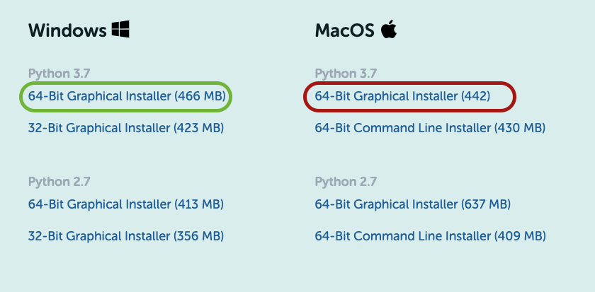
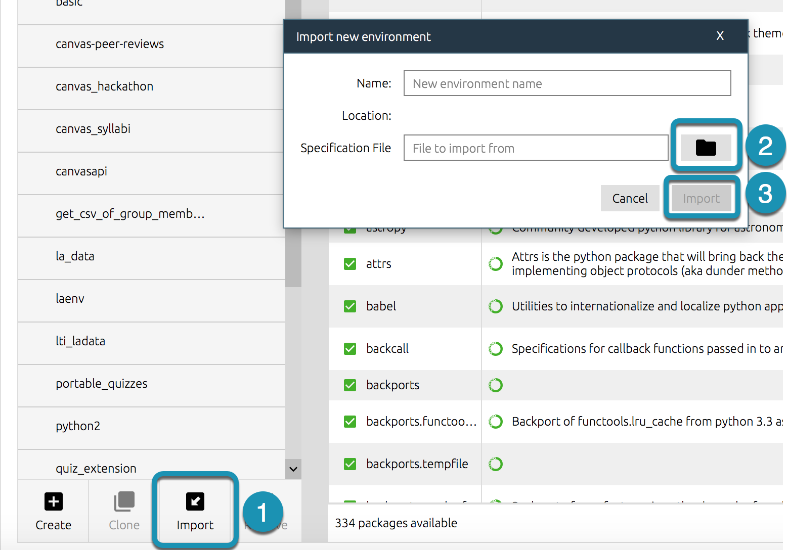
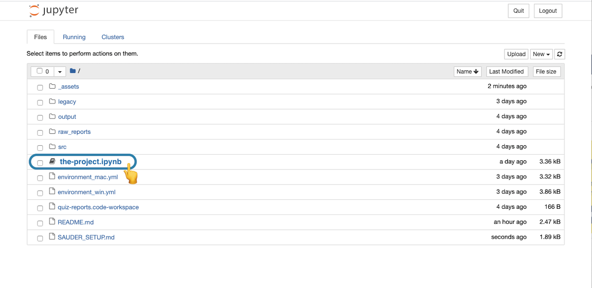

# Getting Started (for Sauder Ops team)

***the-project** should be the name of the script or project you are running, some of the screenshots are from a project called "quiz_reports". Unless otherwise noted, Sauder Ops projects will follow the same steps.*

## 🤔 Where to start

- [I **have not** run this script on this computer before](#-first-time-running-it-start-here)
- [I **have** successfully run it on this computer before](#-ran-it-before-start-here)

## 🥇 First time running it? Start here

1. Get a local version of **the-project**
> You can clone the repository, download the zip, or use GitHub Desktop

   - location suggestion: `.../Documents/GitHub/Sauder-Learning-Services/the-project`

2. If not already installed, install [Anaconda](https://www.anaconda.com/products/individual#Downloads) (Python 3.7 version)

   > Note if you are using a older Windows computer you may need to select the 32-Bit Graphical Installer. See [here](https://www.computerhope.com/issues/ch001121.htm) to find out.

   

3. Open Anaconda Navigator:

   1. Open **Anaconda Navigator** application
   2. Click on **Environments** (left panel)
   3. Click on **Import** (bottom)

   

4. Import Environment:

   1. Select **Import** and wait for installation to complete 
   2. Navigate to the the-project folder on your computer and select: `environment.yml`
   > This will automatically name the environment to be the same name as the project folder (i.e. the-project)
   3. Select import and wait for installation to complete

   

   **Now you're all set up! Time to [run it](#-ran-it-before-start-here)**

## 🚀 Ran it before? Start here

1. Open **Anaconda Navigator**, select the ▶️ button next to "the-project" (in the example below it is a project called quiz_reports_env, all of our environments should match the project folder) env and select **Open with Jupyter Notebook** (this should start your browser)

   

2. In the browser, navigate to the **the-project** project folder and select **The Project.ipynb** (Note this will be located wherever you saved it in Step 1)

   

3. In the notebook, select **Kernal** > **Restart & Run All**

   
